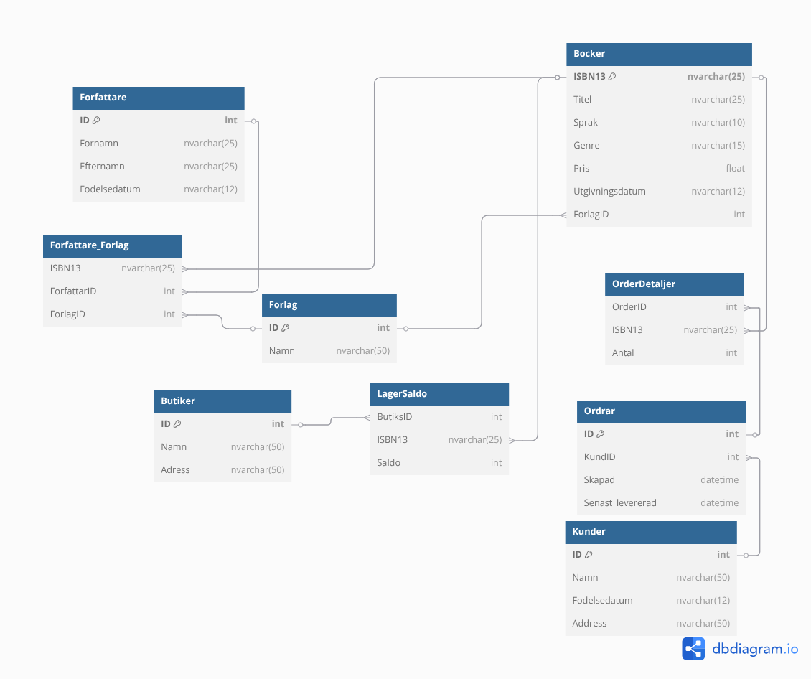

### ER-Diagram

### Filer

- booksearch.py : Program för att söka upp böcker genom sökord och även se dess lagersaldo per butik.
- boksearchvy.sql : Detta är vyn/sql-query som används i booksearch.py
- forfattarvy.sql : Vy som listar alla författare med Namn, Ålder, Antal Titlar och deras totala lagervärde med deras böcker.
- extravy_orderstatus.sql : Detta är en extravy som listar Ordrar och dess totala tid som man har på sig att utföra ordern och tid kvar tills Deadline, och även volymen på ordern med antalet böcker. Bra att veta är att eftersom det finns mycket tabeller så är all data genererad och därför kan viss data verka märklig såsom att en Order har 5 min på sig att utföras och att skapande-datum är i framtiden.
- ER_diagram.png : Bild på hela databasstrukturen till databas Bokhandel
- Bokhandel.bak : Backup-fil på hela databasen
- 

### Kommentar gällande Store Procedure book_transaction (FlyttaBok)
- Har skapat en constraint i LagerSaldo som gör att det inte går att få ett negativt saldo hos en butik vilket skapar dataintigritet.

### Funktionalitet i booksearch.py
- Den består av en sökloop där du anger ett sökord och får boktitlar som matchar sökordet eller där sökordet är en del av boktiteln. Sedan får du lagersaldot för varje bok för respektive butik. Datan kommer från en fördefinierad query-vy som sedan formateras till en pandas dataframe som sedan visas. Du kan göra flera sökningar eller välja att skriva in exit för att avsluta programmet. Sql-query är också parameteriserad för att skydda mot sql-injections.

### Syfte med extravy_orderstatus.sql
- Det som är fördelaktigt med denna vy är just att du lätt kan hålla deadlines för varje order eftersom den är rangordnad efter order med lägst tid kvar innan deadline. Detta hjälper som företag att prioritera rätt order men även ha koll på större ordrar så man i förväg kan börja plocka större ordrar innan det närmar sig deadline.

